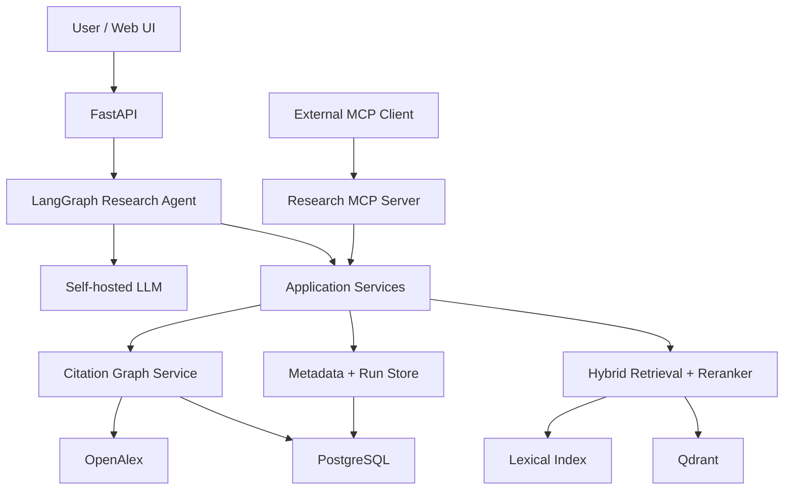
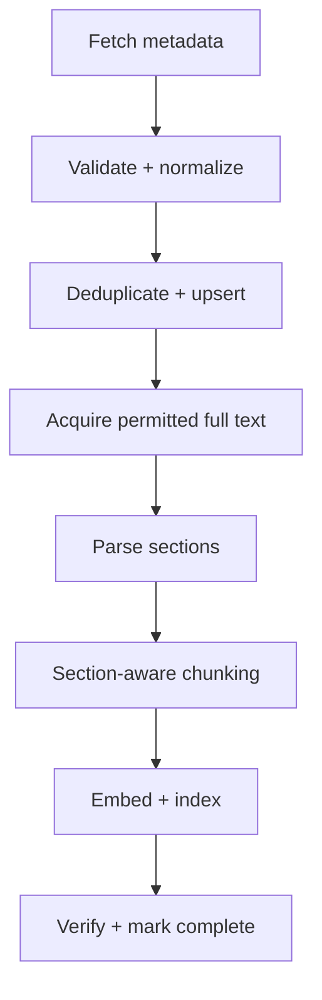
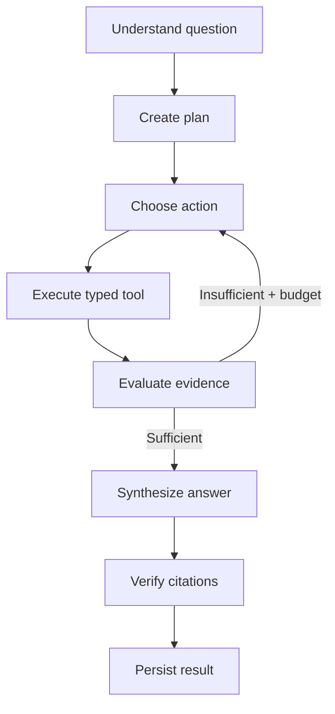
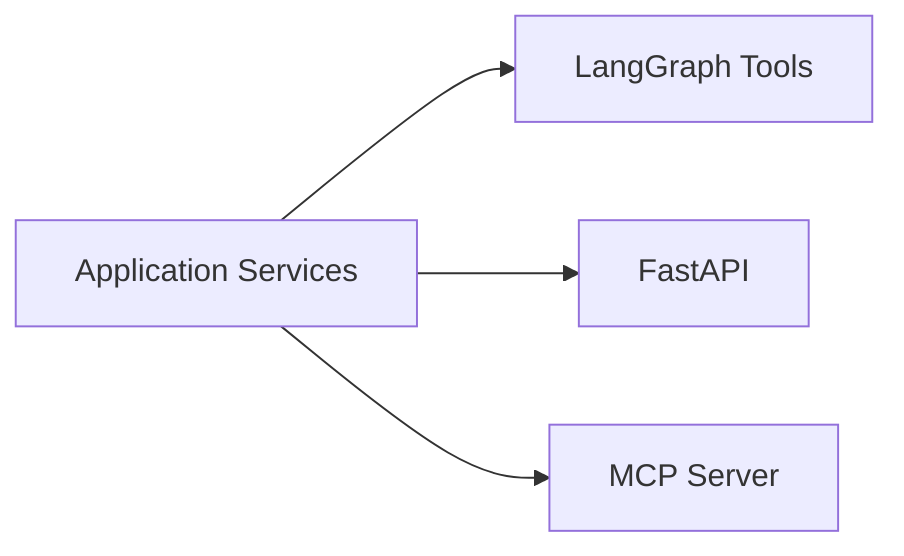

# Scientific Research Platform — Project Source of Truth

**Document status:** Authoritative<br>
**Version:** 1.12\
**Last updated:** 2026-09-26\
**Audience:** Human contributors and coding agents<br>
**Project stage:** Phase 1 accepted corpus retained; Phase 2 entry checks complete; retrieval implementation in progress\

---

## 1. How to use this document

This file is the authoritative specification for the project. Before planning, generating code, changing architecture, selecting infrastructure, or adding a dependency, an agent MUST read this document.

Normative terms:

- **MUST / MUST NOT:** mandatory constraint.
- **SHOULD / SHOULD NOT:** strong default; deviation requires a documented reason.
- **MAY:** optional and permitted.
- **LOCKED:** explicitly agreed; change only through the decision process below.
- **OPEN:** not yet decided; do not silently choose a permanent solution.

When instructions conflict, use this precedence:

1. The user's latest explicit instruction.
2. This source-of-truth document.
3. Accepted Architecture Decision Records (ADRs).
4. Phase plans and issue descriptions.
5. Existing implementation details.

An agent MUST NOT reinterpret an OPEN decision as a LOCKED decision. For a reversible local implementation detail, it MAY choose a conservative default and record the assumption. For a choice that affects architecture, data compatibility, cost, security, or project scope, it MUST ask for a decision or propose an ADR before proceeding.

### Change-control rule

A material change to scope, architecture, core technology, public API, data model, evaluation contract, deployment strategy, or security model requires:

1. A short ADR describing context, decision, alternatives, and consequences.
2. User approval when the change alters a LOCKED decision.
3. An update to this document in the same change set.

---

## 2. Project definition

### 2.1 Working name

**Scientific Research Platform**

The repository/package name may later be branded differently. Until then, use a neutral slug such as `scientific-research-platform`.

### 2.2 Product statement

Build a production-oriented, self-hosted, agentic scientific research platform that searches scholarly literature, retrieves and reranks evidence, traverses citation relationships, and generates structured answers whose claims can be traced to source passages.

### 2.3 Portfolio goal

This is not a notebook-only RAG demonstration. It MUST demonstrate credible ability across:

- information retrieval;
- applied machine learning and evaluation;
- agentic AI and typed tool calling;
- backend and data engineering;
- LLMOps and observability;
- testing and security;
- containerization, simple professional CI/CD, and real deployment;
- MCP interoperability.

The system SHOULD be coherent enough that every major component has a technical reason to exist. Technologies MUST NOT be added only to increase keyword coverage on a résumé.

### 2.4 Primary user experience

A user asks a research question, optionally supplies filters, and receives:

- a synthesized answer;
- claim-level citations;
- the exact evidence passages supporting each claim;
- paper metadata;
- a persistent research run identifier;
- enough provenance to reproduce or inspect the run.

### 2.5 Reference question

> What evidence published after 2022 suggests that reranking improves retrieval-augmented generation, and which methods appear most frequently?

This question illustrates the desired behavior: query interpretation, filtered paper search, evidence retrieval, possible citation traversal, comparison, synthesis, and citation verification.

---

## 3. Goals, non-goals, and constraints

### 3.1 Goals — LOCKED

The finished project MUST:

1. Provide a real FastAPI backend with typed request/response contracts.
2. Store relational metadata and operational state in PostgreSQL.
3. Use Qdrant as a running vector database service.
4. Implement lexical, dense, hybrid, and reranked retrieval.
5. Support metadata filtering and citation-graph traversal.
6. Use a self-hosted, tool-capable LLM for the core agent and answer generation path.
7. Implement a bounded, stateful LangGraph research workflow.
8. Provide typed tools backed by framework-independent application services.
9. Produce claim-to-evidence-to-paper provenance.
10. Include reproducible ingestion that is idempotent and resumable.
11. Evaluate retrieval, reranking, tool use, generation, citations, safety, latency, and end-to-end behavior.
12. Include request tracing, structured logs, metrics, and configuration/version provenance.
13. Include unit, integration, API, regression, and security-focused tests.
14. Run locally through Docker Compose.
15. Use a simple, professional GitHub Actions pipeline.
16. Provide at least one genuinely deployed demonstration environment.
17. Expose selected research capabilities through one MCP server.
18. Remain feasible for development on a laptop with an NVIDIA RTX 3050.

### 3.2 Non-goals — LOCKED

The project MUST NOT include the following unless this document is deliberately revised:

- generator fine-tuning;
- Spark or Databricks for a corpus that fits comfortably in the selected stack;
- Kubernetes, ArgoCD, Jenkins, or Terraform solely for portfolio signaling;
- a multi-agent cast of researcher, critic, reviewer, planner, and similar roles;
- MCP between every internal service;
- separate MCP servers for retrieval, citations, metadata, evaluation, or the LLM;
- an elaborate frontend that competes with the retrieval and systems work;
- a production-scale enterprise identity platform;
- dependence on proprietary hosted LLM APIs for the primary operating path;
- invented or simulated citation relationships presented as GraphRAG.

### 3.3 Practical constraints — LOCKED

- Primary development hardware: laptop with NVIDIA RTX 3050.
- The generator, embedding model, and reranker MUST have locally runnable configurations.
- Evaluation and CI MUST offer small/fast profiles that do not require a GPU or a live large model.
- A cloud GPU MUST NOT need to run continuously for the public portfolio to remain useful.
- Dataset licensing and full-text access MUST be respected; only permitted content may be stored and indexed.

---

## 4. Architectural principles

1. **Core capabilities are framework-independent.** Retrieval, metadata, citation traversal, and evidence services MUST NOT live inside LangGraph or the MCP adapter.
2. **The agent decides; tools act.** The LLM chooses the next action. Typed tools execute deterministic application capabilities.
3. **Control autonomy.** Agent loops require budgets, timeouts, duplicate-call prevention, validation, and explicit stop conditions.
4. **Evidence before prose.** The system gathers and validates evidence before synthesis.
5. **Provenance is a product feature.** Every material claim SHOULD be traceable to immutable document/chunk identifiers and paper metadata.
6. **Measure components separately.** A poor final answer must be diagnosable as a retrieval, reranking, agent, or generation failure.
7. **Configuration is versioned.** Model, prompt, retriever, chunker, parser, and evaluation versions are part of run provenance.
8. **Simple operations, serious engineering.** Prefer one understandable deployment path and one CI workflow over infrastructure sprawl.
9. **Notebooks discover; `src/` delivers.** Winning experimental logic MUST move into tested application modules.
10. **Replaceable adapters.** Frameworks, models, and storage clients SHOULD be behind interfaces where replacement is plausible.

---

## 5. System context and boundaries



Observability surrounds the API, agent, tools, retrieval pipeline, model calls, and persistence operations. Evaluation operates both offline against fixed datasets and online against stored run traces.

### 5.1 Primary request flow

1. FastAPI validates the request and creates a persistent research run.
2. The research agent interprets the question and creates or updates a search plan.
3. The agent selects typed tools.
4. Tools call application services, not databases directly.
5. Search services perform lexical and dense retrieval, fusion, filtering, and reranking.
6. Citation tools query locally stored relationships and, when allowed, OpenAlex-backed services.
7. Evidence is accumulated in bounded agent state.
8. The agent evaluates whether evidence is sufficient or another action is justified.
9. The generator produces a structured answer with claim/evidence links.
10. A citation verification step checks that cited identifiers exist in the retrieved evidence and support the mapped claim.
11. The backend persists status, outputs, provenance, metrics, and errors.

---

## 6. Technology decisions

### 6.1 LOCKED technology choices

| Concern | Decision | Rationale |
|---|---|---|
| Language | Python | Primary language for ML, retrieval, agents, and backend |
| API | FastAPI + Pydantic | Typed async-capable HTTP service and generated API schema |
| Relational store | PostgreSQL | Metadata, ingestion, runs, configuration references, citations |
| Vector store | Qdrant | Dense retrieval with filtering as an actual service |
| Agent orchestration | LangGraph | Explicit state, nodes, loops, and bounded execution |
| Citation metadata | OpenAlex | Real scholarly metadata and citation relationships |
| LLM serving | Self-hosted adapter; Ollama or llama.cpp compatible | Local operation and replaceable model backend |
| LLM observability | Langfuse-compatible tracing | Trace prompts, model calls, tool calls, latency, and scores |
| Packaging | `pyproject.toml` with a `src/` layout | Professional, installable Python project |
| Local runtime | Docker Compose; host-published development ports bind to `127.0.0.1` ([ADR-0006](../adr/0006-compose-loopback-host-bindings.md)) | Reproducible multi-service development environment, accessible from the host only by default |
| CI/CD | GitHub Actions + Docker | Simple, readable testing/build/release flow |
| Interoperability | One Scientific Research MCP server | Reuse the same application services from external AI clients |

### 6.2 OPEN implementation choices

These choices MUST be evaluated or recorded in ADRs before being treated as permanent:

- lexical retrieval engine/library;
- exact embedding model;
- exact cross-encoder reranker;
- exact local tool-capable generator and quantization;
- local LLM serving implementation between supported adapters;
- background execution mechanism for long research runs and later API-controlled ingestion (Phase 1 uses resumable terminal commands);
- production/demo hosting provider;
- authentication mechanism for the deployed demo;
- caching implementation;
- frontend framework;
- broader ML corpus expansion and exact full-text adapters (initial corpus policy is fixed in Section 8.6);
- citation graph representation details within PostgreSQL;
- exact experiment/configuration tracking persistence beyond Langfuse traces.

Candidates MAY be benchmarked in notebooks, but benchmark results and hardware feasibility MUST justify final selection.

### 6.3 Explicit exclusions

Fine-tuning, Spark/Databricks, a dedicated graph database, Kubernetes, and multi-agent orchestration are not part of the baseline. A proposal to add any of them requires measurable need, an ADR, and approval.

---

## 7. Backend design

### 7.1 Layering

The backend MUST separate:

- **API layer:** HTTP transport, authentication, validation, response mapping.
- **Application/service layer:** use cases and orchestration of domain capabilities.
- **Domain layer:** core types, invariants, retrieval/evidence concepts.
- **Repository/adapters:** PostgreSQL, Qdrant, OpenAlex, model server, tracing.
- **Agent layer:** state machine and tool selection using service interfaces.
- **MCP adapter:** external protocol mapping over application services.

Routes, LangGraph nodes, and MCP handlers MUST NOT contain raw SQL, Qdrant query construction, or duplicated retrieval logic.

### 7.2 API baseline — LOCKED

Required endpoints:

| Method | Path | Purpose |
|---|---|---|
| `POST` | `/v1/research` | Start a research run |
| `GET` | `/v1/research/{run_id}` | Get run status/result |
| `POST` | `/v1/search` | Search papers |
| `POST` | `/v1/evidence/search` | Search evidence passages |
| `GET` | `/v1/papers/{paper_id}` | Get paper metadata |
| `GET` | `/v1/papers/{paper_id}/citations` | Get citing papers |
| `GET` | `/v1/papers/{paper_id}/references` | Get referenced papers |
| `POST` | `/v1/collections` | Create a collection/corpus boundary |
| `POST` | `/v1/collections/{collection_id}/ingest` | Start or resume ingestion |
| `GET` | `/health` | Process liveness |
| `GET` | `/ready` | Dependency readiness |

API versioning MUST begin at `/v1`. Error responses MUST be structured and MUST NOT leak secrets or raw internal stack traces.

### 7.3 Research request contract

Illustrative request:

```json
{
  "question": "What evidence supports hybrid retrieval over dense retrieval?",
  "filters": {
    "year_from": 2022
  },
  "mode": "deep_research"
}
```

Illustrative completed response:

```json
{
  "run_id": "opaque-id",
  "status": "completed",
  "answer": "...",
  "claims": [
    {
      "claim_id": "claim-1",
      "text": "...",
      "evidence_ids": ["paper-id:chunk-id"]
    }
  ],
  "papers": [],
  "provenance": {
    "configuration_id": "...",
    "trace_id": "..."
  }
}
```

Exact schemas will be versioned in code. The invariant is that each cited claim maps to retrieved evidence and its paper.

### 7.4 Reliability requirements

The backend MUST implement:

- typed settings loaded from environment variables;
- dependency injection or equivalent explicit wiring;
- connection lifecycle management;
- request and model timeouts;
- bounded retries with backoff only for retryable failures;
- idempotency for ingestion operations;
- safe cancellation/failure status for long runs;
- request correlation IDs;
- structured error classes and consistent error mapping;
- input and output size limits;
- pagination for potentially large collections;
- database migrations;
- graceful readiness failure when required dependencies are unavailable.

Async code SHOULD be used for I/O-bound work where it improves concurrency. CPU/GPU-heavy work MUST NOT block the main event loop.

---

## 8. Data and ingestion architecture

### 8.1 Sources

- **OpenAlex:** paper metadata, authorship, concepts/topics, and citation relationships.
- **Full text:** source-specific permission for acquisition/indexing, with public passage display considered separately. Phase 1 uses OpenAlex content and explicitly supported publisher/repository locations; exact adapters remain OPEN under Section 8.6.
- **Evaluation datasets:** QASPER and SciFact are baseline candidates, subject to task/corpus mapping and license verification.

### 8.2 Ingestion flow — LOCKED



The pipeline MUST be:

- idempotent;
- resumable after partial failure;
- observable at document and batch level;
- version-aware for source document, parser, chunker, and embedding model;
- able to reprocess only affected stages when a version changes;
- explicit about failed, skipped, partial, and completed states.

### 8.3 Minimum relational entities

The PostgreSQL model MUST cover at least:

- `papers`;
- `authors`;
- `paper_authors`;
- `citations`;
- `documents` / source versions;
- `sections`;
- `chunks` with stable identifiers and source offsets;
- `collections` and collection membership;
- `ingestion_jobs` and per-document ingestion state;
- `research_runs`;
- `tool_calls` or equivalent persisted run events;
- `claims` and claim/evidence mappings;
- configuration/model/prompt version references.

Exact names and normalization may change through an ADR. PostgreSQL is the source of truth for metadata and run provenance; Qdrant is a derived search index and MUST be rebuildable.

### 8.4 Vector payload requirements

Each Qdrant point MUST include or reference:

- stable chunk ID;
- paper ID;
- document/source version;
- section identity/title;
- publication year and filterable metadata required by search;
- embedding model/version;
- collection/corpus identity;
- enough information to resolve the authoritative text in PostgreSQL/object storage.

Do not treat Qdrant as the sole authoritative store for source text or provenance.

### 8.5 Citation graph

Citation relationships MUST originate from real OpenAlex-linked identifiers. Baseline graph traversal SHOULD use PostgreSQL adjacency tables and indexed queries. A dedicated graph database is excluded unless profiling proves a material need.

### 8.6 Phase 1 corpus policy — LOCKED

Initial policy approved 2026-09-22; detailed execution and acceptance decisions
approved 2026-09-23. The [Phase 1 plan](../plans/phase-1-corpus-ingestion.md)
defines tasks and acceptance evidence, and the [learning handoff](../plans/phase-1-learning-handoff.md)
records the next step. [ADR-0001](../adr/0001-versioned-corpus-evidence.md) records
versioned evidence tradeoffs; [ADR-0002](../adr/0002-finalize-validated-snapshots.md)
records finalization and quality acceptance.

- **Scope:** start with RAG, retrieval and reranking; expand toward broader ML research later. The initial collection covers English-language papers from 2020 through its snapshot date, with explicit older foundational exceptions. Require substantive relevance, including negative and mixed findings; merely using RAG is insufficient.
- **Selection:** Phase 1 MUST deliver reproducible discovery and an explainable candidate shortlist with configurable queries/filters, duplicate handling and recorded selection signals. A human reviewer approves the versioned manifest of membership and inclusion/exclusion reasons; the user may explicitly delegate that reviewer decision to the assistant. On 2026-09-25 the user delegated membership for the Phase 1 100-paper set, and the assistant recorded its decision in **the membership review** (`manifests/phase1-100-paper-membership-decision.json`, local-only evidence omitted from Git). This delegation does not waive exact-file permission checks. Evaluate shortlist relevance, coverage and bias against retained review decisions, reporting limitations; a learned classifier is not required.
- **Milestones:** 10 full-text papers for the initial end-to-end comparison, then 100 successfully ingested full-text papers. These are engineering milestones, not claims of research sufficiency. Use local compute without paid data acquisition or cloud compute initially.
- **Access:** use OpenAlex discovery/metadata and a bounded set of supported download sources. Record applicable permission evidence, source URL, acquisition time, checksum and document version. Downloadability alone is not permission for all uses; assess public passage display separately. Unresolved or unavailable full text remains metadata-only.
- **Identity:** one logical paper with separately identifiable document versions. Prefer the published version, falling back to an eligible preprint. Index one selected version per paper in a snapshot and label the actual evidence source. Link versions only with reliable identifiers or metadata; leave uncertain matches separate.
- **Citation collection:** retain real citation edges and unresolved external identifiers before complete metadata is available; enrich through bounded metadata requests without inventing missing titles. Do not recursively acquire referenced full text. Related papers are candidates for later selection.
- **Evidence:** text and structured tables are required. Preserve table headers, values, captions, units, footnotes and source references. Split large tables into row groups with relevant headers repeated; respect section boundaries for text. Table-heavy papers MUST be supported rather than excluded because of their format. Actual extraction failures remain visible and require investigation or reprocessing.
- **Extraction choice:** the 2026-09-24 comparison selected Docling StandardPdfPipeline as the automatic Phase 1 parser and a pinned local Granite-Docling VLM as a review-only aid for sparse multi-header tables. Do not automatically merge VLM table cells because the reviewed fallback candidate lacked header markers and used a different grid shape. Record parser, model, package and effective configuration versions. The [comparison report](../reference/phase-1-extraction-comparison.md) and [ADR-0004](../adr/0004-phase1-pdf-extraction.md) define the pilot strategy and numerical acceptance thresholds. Keep the original PDF as the source for visual inspection; preserve extracted figure captions and formula text, but do not interpret figure pixels or generate chart summaries in Phase 1.
- **Execution:** manually trigger versioned snapshots through terminal start/status/resume operations over reusable application services and persisted job state. Processing stops when the process stops; saved progress permits resumption. Allow one active ingestion process initially with concurrent-start protection and explicit crash recovery; bounded download concurrency and controlled extraction/embedding batches remain possible. API-controlled background scheduling is deferred, not removed from the eventual API contract.
- **Failures:** continue unaffected papers after paper-specific failures, recording stage and reason for targeted retries. Pause for shared failures such as database unavailability or storage exhaustion. Mark successful ingestion only after evidence/index integrity checks; failed and metadata-only records do not count toward the full-text target.
- **Storage:** retain unique originals once, compress extraction outputs, share artifacts across collections and promptly clean temporary files. Store artifacts outside Git and metadata, checksums, versions and job state in PostgreSQL. Retain additional versions only when retained snapshots or research runs require them; do not silently replace or delete their evidence. Keep Qdrant rebuildable. Measure usage on 10 papers and set a configurable storage cap before scaling.

- **Snapshot acceptance:** processing produces inspectable/testable drafts. Normal research MUST use explicitly finalized snapshots with validated, fixed membership, selected document/extraction versions, effective configurations and evidence/index integrity. New evidence/configuration requires a new snapshot. A smaller finalized snapshot does not satisfy the 100-paper target.
- **Quality failures:** unresolved extraction failures, including a results-table validation failure, prevent a paper from counting as successfully ingested. Preserve intermediate outputs for alternative extraction or reviewed correction with provenance. Exclusions and replacements MUST be explicit selection decisions, never silent quality filtering.
- **Verification scope:** prepare human-verified text/table samples from every paper in the 10-paper comparison before evaluating approaches. For the 100-paper pilot, run automated integrity checks across all papers and a documented manual quality sample. Report sampling and coverage without implying exhaustive cell-level review.

Chunk-size/token-overlap baselines remain OPEN pending later corpus and retrieval
evaluation. The ten-paper indexing pilot uses reversible E5-small-v2 settings;
the final embedding choice remains OPEN for Phase 2. The measured ten-paper
source-artifact footprint is 11,587,433 bytes, and the 2 GiB hard acquisition cap
is retained for the 100-paper pilot with an explicit tenfold-size projection in
the [pilot report](../reference/phase-1-full-extraction-pilot.md). Disposable
retention periods remain OPEN. Extraction quality thresholds are in the P1-08
comparison report. Automated refresh remains deferred.

---

## 9. Retrieval architecture

### 9.1 Required pipeline — LOCKED

1. Query normalization and filter validation.
2. Lexical retrieval.
3. Dense retrieval from Qdrant.
4. Reciprocal Rank Fusion (RRF) or another approved fusion method.
5. Cross-encoder reranking of the fused candidate set.
6. Diversity/deduplication and context-budget selection.
7. Return evidence passages with component scores and provenance.

Both paper-level discovery and passage-level evidence retrieval MUST be supported. Metadata filters MUST be applied correctly rather than simulated through prompt text.

### 9.2 Retrieval interfaces

The application layer SHOULD expose interfaces equivalent to:

```python
search_papers(query, filters, limit) -> list[PaperHit]
search_evidence(query, paper_ids, filters, limit) -> list[EvidenceHit]
get_paper(paper_id) -> Paper
get_citations(paper_id, limit) -> list[Paper]
get_references(paper_id, limit) -> list[Paper]
find_related_papers(paper_id, limit) -> list[Paper]
```

Return types MUST be typed. Search hits MUST retain component ranks/scores, fused rank/score, reranker score where applicable, and stable source identifiers.

### 9.3 Experimental expectations

The project MUST compare at least:

- lexical-only vs dense-only vs hybrid;
- hybrid before and after reranking;
- at least two credible embedding candidates if hardware permits;
- section-aware chunking against one simpler baseline;
- quality/latency trade-offs for meaningful top-k and reranking settings.

Claims of improvement MUST include fixed datasets, versioned configurations, uncertainty or repeated-run analysis where relevant, and not only anecdotal examples.


### 9.4 Phase 2 retrieval and evaluation policy — LOCKED

Approved 2026-09-26 after the planning interview. The
[execution roadmap](../plans/phase-2-retrieval-evaluation.md),
[evaluation protocol](../plans/phase-2-evaluation-protocol.md),
[agent handoff](../plans/phase-2-agent-handoff.md) and
[ADR-0008](../adr/0008-phase2-retrieval-evaluation-boundaries.md) elaborate these rules.

- **Corpus and provenance:** use the accepted 100-paper corpus for the initial
  benchmark; preserve its finalized snapshot. Model/chunk experiments use separately
  versioned variants and indexes that share unchanged sources/extraction. Serving
  uses finalized snapshots; draft experiments require a separate explicit evaluation
  path. Source judgments remain independent of chunk boundaries.
- **Search:** implement lexical BM25, dense, rank fusion and cross-encoder reranking.
  BM25S is the local lexical implementation candidate, conditional on measured
  resource, filter and reproducibility checks before dependency acceptance.
  Compare E5-small-v2 with BGE-base-en-v1.5 if feasible; compare MiniLM-L6-v2 and
  BGE-reranker-base rerankers after bounded hardware pilots. Revisions, preprocessing
  and input limits are recorded. Final defaults are selected by development results.
- **Paper/evidence behavior:** return one result per paper, combining title/abstract
  and evidence discovery while retaining separate component scores. The strongest
  passage is the initial paper evidence score, with up to three distinct supporting
  hits. Evidence results remove redundant overlap and use configurable per-paper
  limits; structured tables retain source-linked headers, values, units and footnotes.
- **Filters and graph:** require an explicit snapshot; support inclusive year ranges,
  selected paper IDs, evidence kinds and published/preprint document-version kinds
  where applicable. Apply consistent eligibility before lexical/dense top-k; missing
  metadata cannot silently satisfy a filter. Include bounded stored one-hop citation/
  reference lookup with unresolved and out-of-corpus endpoints explicitly identified.
  Citation-driven expansion and multi-hop traversal remain Phase 3 work.
- **Private local access:** Phase 2 serves trusted private local research and evidence
  inspection through a service-layer policy requiring applicable source permissions.
  Existing public-display restrictions remain unchanged. A request flag cannot grant
  private inspection rights. Public passage exposure requires a separate decision.
- **Benchmark and review:** cover discovery, specific evidence, tables, cross-paper
  comparison, filters and missing evidence. Begin with ten calibration questions;
  select larger benchmark size/workload after measuring review effort. The user has
  delegated all Phase 2 implementation, calibration and source review for now. New
  labels are assistant-reviewed with source checks and uncertainty, never described
  as human-verified by inheriting Phase 1 annotations.
- **Evaluation:** use separate calibration/development and held-out question families;
  source relevance labels are 0 irrelevant, 1 useful context/incomplete support and
  2 direct evidence. Pool candidates across methods and inspect sources. Report paper
  and evidence nDCG@10, direct MRR@10, judged Recall@20/@50, required-evidence coverage,
  unsupported-query behavior, judgment coverage, failures and resource/latency metrics.
  Duplicate chunks earn no repeated source-evidence credit; incomplete judgments and
  small-sample uncertainty remain explicit.
- **Experiments and acceptance:** compare section-aware prose with fixed-size overlapping
  windows while holding structured table handling constant. Reuse retained extraction.
  Choose useful-quality and numerical runtime gates after development baselines and
  freeze them before held-out evaluation. Improvements are measured, not predetermined;
  simpler retrieval may win. External benchmarks are optional follow-up work.
- **Operations:** target interactive single-user laptop operation, measure cold costs
  separately from warm median/p95 latency, and retain CPU operation and GPU-free CI.
  Execution is bounded. Default failures are explicit; requested fallbacks identify
  the actual ranking used and count separately in evaluation. Scores are not support
  probabilities; optional rejection cutoffs require calibration for their profile.

The plan authorizes its decisions and delegated workflow; Phase 2 implementation
begins on an implementation request. Routine decisions within these boundaries are
delegated. Material deviations follow section 1 change control.

---

## 10. Agent and tool-calling design

### 10.1 Agent model — LOCKED

Use one primary stateful research agent implemented as a LangGraph workflow. It MAY use deterministic validation nodes, but MUST NOT be decomposed into multiple persona agents without a new decision.

### 10.2 Minimum state

`ResearchState` MUST represent at least:

- question and validated filters;
- research mode;
- search plan;
- candidate papers;
- retrieved evidence;
- visited papers;
- tool-call history;
- claims and citation mappings;
- iteration and budget counters;
- configuration/provenance identifiers;
- recoverable errors and terminal failure information.

State SHOULD store references to large results rather than duplicating unbounded text.

### 10.3 Workflow



The workflow MUST have explicit maximums for:

- agent iterations;
- total tool calls;
- repeated identical calls;
- citation traversal depth;
- candidate/evidence count;
- context tokens;
- wall-clock duration;
- model retries.

These limits MUST be configurable and captured in run provenance.

### 10.4 Tool contract — LOCKED

Initial tools:

- `search_papers`
- `search_evidence`
- `get_paper`
- `get_citations`
- `get_references`
- `find_related_papers`

Tool schemas MUST:

- be strongly typed;
- validate identifiers, filters, ranges, and result limits;
- use narrow descriptions that support correct tool selection;
- return compact, structured observations;
- identify retryable vs terminal errors;
- enforce authorization and resource budgets outside the model;
- avoid exposing arbitrary code, SQL, URLs, or filesystem access.

The LLM MUST NOT be trusted to enforce tool budgets or safety rules by prompt alone.

### 10.5 Structured generation

The generator MUST emit a validated structure containing answer text, claims, and evidence references. Invalid output MAY be repaired through a bounded retry. Fabricated or unknown evidence IDs MUST cause verification failure, not silent acceptance.

---

## 11. MCP design

### 11.1 Role — LOCKED

MCP is a thin interoperability adapter over the same application services used by FastAPI and LangGraph.



The internal LangGraph agent SHOULD call services directly through Python interfaces. It MUST NOT route all internal calls through MCP.

### 11.2 MCP surface

The single Scientific Research MCP server SHOULD expose 5–8 high-value capabilities.

Initial MCP tools:

- `search_papers`
- `search_evidence`
- `get_paper`
- `get_citations`
- `get_references`
- `find_related_papers`

Candidate resources:

- `paper://{paper_id}`
- `paper://{paper_id}/abstract`
- `paper://{paper_id}/sections`
- `paper://{paper_id}/references`
- `research-run://{run_id}`

Candidate prompts, if they provide real value:

- `literature_review`
- `compare_methods`
- `trace_claim`
- `find_supporting_evidence`

Prompts are optional; tools and selected resources are the priority.

### 11.3 Transports and security

- Local development SHOULD support stdio where useful.
- Remote deployment SHOULD use the current production-recommended HTTP transport supported by the selected official MCP SDK.
- Remote MCP access MUST use authentication, rate limits, input validation, and the same service-layer authorization as the HTTP API.
- Protocol/SDK versions MUST be pinned and the implemented MCP specification version MUST be documented because the protocol evolves.

MCP is added after core services and tools work reliably; it MUST NOT block early retrieval development.

---

## 12. Self-hosted models

### 12.1 Requirements

The baseline operating path MUST support locally/self-hosted:

- a tool-capable instruction/reasoning model;
- an embedding model;
- a cross-encoder reranker.

Model selection MUST consider:

- RTX 3050 memory constraints;
- quantized inference viability;
- tool-call/structured-output reliability;
- answer faithfulness;
- tokens per second and end-to-end latency;
- license and redistribution constraints;
- reproducibility.

### 12.2 Abstraction

Application code MUST use model interfaces/adapters rather than importing one serving backend throughout the codebase. The active model name, quantization, runtime, prompt version, decoding parameters, and relevant context limits MUST be recorded per run.

Hosted APIs MAY be used for optional comparative evaluation if clearly labeled, but the core project MUST remain functional without OpenAI, Anthropic, Gemini, or another proprietary generator.

---

## 13. Evaluation strategy

Evaluation is a core product subsystem, not a final demo script.

### 13.1 Evaluation layers

| Layer | Required measurements |
|---|---|
| Lexical/dense/hybrid retrieval | Recall@K, MRR, NDCG@K, precision where appropriate |
| Reranking | NDCG/MRR lift, recall retention, latency cost |
| Agent/tool use | tool-selection accuracy, argument validity, unnecessary calls, task completion, steps/task |
| Generation | answer correctness, faithfulness/groundedness, completeness |
| Citations | citation precision, citation recall/coverage, valid evidence IDs, claim support |
| End to end | success rate, latency distribution, failure categories, resource usage |
| Safety | prompt-injection resistance, tool abuse prevention, data-boundary adherence |

### 13.2 Benchmark composition

The suite SHOULD combine:

- established scientific QA/verification datasets such as QASPER and SciFact where compatible;
- a curated project-specific set of representative research tasks;
- deterministic tool-routing cases;
- citation traversal cases;
- adversarial retrieved-content cases;
- small smoke/regression subsets suitable for CI.

Expected tool paths SHOULD be specified only for tasks where the required action is objectively constrained. The evaluation MUST not reward one arbitrary plan when several plans can validly solve the task.

### 13.3 Experiment record

Every reported experiment MUST retain:

- dataset and version;
- code revision;
- full configuration ID/hash;
- parser, chunker, embedding, reranker, and generator versions;
- prompt/tool schema versions;
- random seed where applicable;
- hardware/runtime profile;
- quality metrics;
- latency and resource metrics;
- failures and sample-level outputs sufficient for error analysis.

### 13.4 Regression gates

CI will use a small deterministic suite. Thresholds are OPEN until a stable baseline exists. Once adopted, thresholds MUST be versioned and changes justified. CI SHOULD fail on material regressions such as invalid citations, broken tool schemas, large retrieval-quality drops, or API contract failures.

LLM-as-judge MAY supplement evaluation but MUST NOT be the only source of truth. Judge model, prompt, and variance MUST be recorded.

---

## 14. Observability and LLMOps

### 14.1 Trace model — LOCKED

Each research request MUST create one trace with nested spans for relevant operations, for example:

- request validation and run creation;
- planning/agent decision;
- each tool call;
- lexical search;
- dense search;
- fusion;
- reranking;
- citation lookup;
- evidence selection;
- generation;
- citation verification;
- persistence.

### 14.2 Required trace attributes

Capture, subject to privacy/security constraints:

- request/run/trace IDs;
- model and prompt versions;
- embedding/reranker/chunker/parser versions;
- retrieval settings and filters;
- tool name and validated arguments;
- returned document/chunk IDs and scores;
- token counts and context size;
- duration and failure status;
- retry count;
- configuration ID and code revision.

Sensitive values, secrets, and disallowed full-text content MUST NOT be emitted to logs or traces.

### 14.3 Logs, metrics, traces

- **Logs:** structured JSON events with correlation identifiers.
- **Metrics:** request rate, error rate, latency percentiles, retrieval/model latency, agent steps, tool errors, ingestion throughput/backlog, and resource signals.
- **Traces:** one request's complete path through agent, tools, retrieval, and generation.

Langfuse SHOULD cover LLM/agent traces. Standard application logging and metrics MUST cover the rest; Langfuse MUST NOT become the only operational signal.

### 14.4 Reproducibility

Given a run ID, a developer SHOULD be able to determine which code/configuration, corpus/index version, prompt, tool definitions, and models produced the result. Exact bit-for-bit reproduction is not promised for nondeterministic inference, but inputs and configuration MUST be recoverable.

---

## 15. Security and safety

Baseline controls MUST include:

- secrets only through environment/secret management, never committed;
- authentication for deployed API and remote MCP access;
- authorization at service boundaries where collections/runs are scoped;
- request validation and maximum sizes;
- rate limiting and tool-call budgets;
- timeouts and bounded retries;
- safe error responses;
- dependency and container vulnerability scanning;
- pinned/locked dependencies with deliberate updates;
- restricted outbound network access where practical;
- audit-friendly tool/run records;
- explicit separation of trusted system/tool instructions from untrusted retrieved text;
- sanitization/escaping appropriate to rendered outputs.

### 15.1 RAG/agent-specific threat model

The system MUST assume retrieved documents can contain malicious instructions. Retrieved content is evidence, never instruction. Tests MUST include examples such as attempts to:

- override system instructions;
- trigger repeated or unauthorized tool calls;
- exfiltrate secrets or unrelated documents;
- inject fabricated citation identifiers;
- cause unbounded recursion or resource use.

Safety controls MUST be enforced in code, schemas, service authorization, and budgets—not solely through prompts.

---

## 16. Testing strategy

### 16.1 Unit tests

Must cover deterministic logic such as:

- chunking and source offsets;
- RRF/fusion;
- filtering and deduplication;
- citation/evidence mapping;
- schema validation;
- tool argument validation;
- state transitions and budget enforcement;
- prompt construction where deterministic;
- error classification.

### 16.2 Integration tests

Must cover important boundaries:

- application ↔ PostgreSQL;
- application ↔ Qdrant;
- retrieval ↔ reranker;
- agent ↔ tool/service layer;
- ingestion ↔ persistence/indexing;
- MCP handler ↔ application services.

Use ephemeral/test containers or equivalent isolated services. Tests MUST NOT depend on a developer's existing local data.

### 16.3 API tests

Must cover:

- happy paths and schema contracts;
- invalid identifiers and filters;
- missing resources;
- dependency failures and timeouts;
- authentication/authorization behavior;
- idempotent ingestion behavior;
- health/readiness semantics.

### 16.4 AI regression and safety tests

Maintain a small fixed set suitable for CI and a fuller offline suite. Validate at least:

- retrieval thresholds;
- required tool completion;
- no unknown citation IDs;
- claim/evidence mappings;
- bounded loops;
- prompt-injection resistance;
- graceful behavior when evidence is insufficient.

Non-deterministic tests MUST use suitable tolerance/repetition or remain outside blocking CI.

---

## 17. CI/CD and release design

### 17.1 Pull-request CI — LOCKED

One understandable GitHub Actions workflow SHOULD perform:

1. dependency installation from a lock file;
2. lint/format checks with Ruff;
3. static type checking;
4. unit tests;
5. integration and API tests using service containers as needed;
6. the small RAG/agent regression suite;
7. dependency/security checks;
8. Docker image build validation.

Expensive GPU/model evaluations MUST NOT run on every pull request. They MAY run manually, nightly, or before a release.

### 17.2 Main branch and release

- Merge to main: rerun required checks, build the image, and push a versioned image when credentials are available.
- Tagged release: build an immutable production image, publish release metadata, and deploy to the selected target.
- Deployment MUST use a previously tested image rather than rebuilding unrelated source in production.
- Automatic production deployment MAY be introduced, but a single controlled target is enough.

### 17.3 Versioning and artifacts

Images SHOULD be tagged with semantic release version and commit SHA. Database migrations MUST run as an explicit deployment step. Rollback expectations MUST be documented before enabling automatic deployment.

---

## 18. Local and deployed runtime

### 18.1 Local development — LOCKED

The goal is one primary command:

```bash
docker compose up
```

The Compose stack SHOULD include profiles so contributors do not have to start every optional service. The full development environment includes:

- research API;
- PostgreSQL;
- Qdrant;
- local LLM server;
- Langfuse and its required dependencies;
- research MCP server;
- optional worker once the job mechanism is selected.

Model weights and large datasets MUST NOT be baked into the application image.

### 18.2 Production/demo

At least one real environment MUST expose a functional backend/demo. The deployment SHOULD avoid permanent GPU cost. Acceptable patterns include a CPU-compatible small model, a scheduled/on-demand GPU, or a clearly documented local-model demonstration paired with a hosted backend subset.

The final deployment architecture remains OPEN until a cost and feasibility comparison is completed.

---

## 19. Repository structure

Target structure:

```text
scientific-research-platform/
├── src/
│   └── research_platform/
│       ├── api/
│       │   ├── routes/
│       │   ├── schemas/
│       │   ├── dependencies.py
│       │   └── app.py
│       ├── agents/
│       │   ├── graph.py
│       │   ├── state.py
│       │   ├── nodes.py
│       │   └── prompts.py
│       ├── tools/
│       ├── retrieval/
│       │   ├── lexical.py
│       │   ├── dense.py
│       │   ├── fusion.py
│       │   ├── hybrid.py
│       │   └── reranker.py
│       ├── ingestion/
│       ├── domain/
│       ├── services/
│       ├── repositories/
│       ├── llm/
│       ├── mcp/
│       ├── evaluation/
│       ├── observability/
│       ├── config.py
│       └── exceptions.py
├── tests/
│   ├── unit/
│   ├── integration/
│   ├── api/
│   ├── eval/
│   └── security/
├── notebooks/
├── configs/
├── datasets/
│   └── README.md
├── migrations/
├── scripts/
├── docker/
├── docs/
│   ├── agents/
│   │   └── scientific-research-platform-source-of-truth.md
│   ├── architecture/
│   ├── adr/
│   ├── api/
│   └── operations/
├── .github/workflows/
├── docker-compose.yml
├── pyproject.toml
└── README.md
```

Large datasets, model weights, secrets, and generated indexes MUST NOT be committed. Dataset acquisition and index construction MUST be scripted and documented.

---

## 20. Configuration contract

Configuration MUST be declarative, validated, and serializable. A run configuration should cover:

```yaml
generator:
  provider: local
  model: OPEN
  quantization: OPEN

embedding:
  model: OPEN

retrieval:
  lexical_top_k: 50
  dense_top_k: 50
  fusion: rrf
  fused_top_k: 50

reranker:
  enabled: true
  model: OPEN
  top_k: 10

chunking:
  strategy: section_aware
  max_tokens: OPEN

agent:
  max_iterations: OPEN
  max_tool_calls: OPEN
  timeout_seconds: OPEN
```

Values above are illustrative unless stated elsewhere. Configuration secrets MUST be referenced from the environment rather than stored in YAML. Each effective configuration MUST have a stable identifier/hash stored with experiments and runs.

---

## 21. Delivery phases and gates

MCP and polish are deliberately later than the core retrieval and service foundations.

### Phase 0 — Repository and contracts

Status as of 2026-09-23: foundations and completion-audit fixes passed local
verification and hosted [CI run 35852371358](https://github.com/avsngh-git/RAGpipeline/actions/runs/35852371358)
on revision `d104e5607d90643fbd0dbb3119fbb7ace8c8e3fc`. See the [completion
audit](../reviews/phase-0-audit-2026-09-23.md) and [learning handoff](../plans/phase-0-learning-handoff.md).
This status update records evidence; it does not relax the requirements below.

The Phase 1 indexing pilot uses the reversible `intfloat/e5-small-v2`
configuration recorded in [ADR-0005](../adr/0005-phase1-embedding-pilot.md).
This hardware-feasibility result does not close the final embedding-model choice;
that remains open pending Phase 2 retrieval-quality evaluation.

Deliver:

- installable `src/` project;
- configuration and logging foundations;
- FastAPI skeleton with health/readiness;
- PostgreSQL/Qdrant Compose services;
- initial schemas, migrations, CI, test harness;
- ADR and documentation structure.

Gate: clean checkout can run tests and start baseline services from documented commands.

### Phase 1 — Corpus and ingestion

Approved execution plan: [Phase 1 corpus ingestion](../plans/phase-1-corpus-ingestion.md).

The 2026-09-26 completion audit reopened the Phase 1 closeout after acceptance.
The remediation implementation is revision
`d28e1adc299d6199774c78a2d63cb3eb0870d5ab`, with successful hosted
[CI run 36238052340](https://github.com/avsngh-git/RAGpipeline/actions/runs/36238052340).
The [audit closeout](../reviews/phase-1-completion-audit-2026-09-26.md) records local
verification; the Phase 2 planning pass did not rerun every fix. A residual bare
`docs` ignore rule was found after that revision and removed in the planning change.
Sanitized documents must be included in the next committed change set before claiming
fresh-checkout documentation readiness. The accepted 100-paper snapshot is unchanged.
Phase 0 foundations and hosted CI gate are complete. As of 2026-09-25,
P1-02 through P1-12 are complete for the approved ten-paper workflow. Baseline
P1-13 local and hosted verification passed on `ebe1c41602b62c5934fbfe43e51ae765896e3e6e`; [hosted CI run 36053054222](https://github.com/avsngh-git/RAGpipeline/actions/runs/36053054222) completed all steps. The current worktree passed 188 local tests, including all 15 live service checks, Ruff check/format (92 files), strict mypy across 40 source files, migration against a clean disposable database, `pip check`, `pip-audit` with no known vulnerabilities, and a Linux AMD64 Docker build. Hosted CI run [36231611600](https://github.com/avsngh-git/RAGpipeline/actions/runs/36231611600) passed on revision `ed54a046429a7b288830eca0d1a1bcf4e3de87cf`. Since the baseline CI run, the worktree adds the direct-source adapter and its tests, [ADR-0006](../adr/0006-compose-loopback-host-bindings.md), [accepted ADR-0007](../adr/0007-bounded-direct-source-pdf-downloads.md), review records and documentation. The three supplemental title screens are finalized
under the user’s explicit Phase 1 delegation. The assistant prepared a separate
**100-title acquisition shortlist** (`manifests/phase1-100-paper-shortlist-proposal.md`, local-only evidence omitted from Git)
with 10 already acquired v1 references, 21 expansion candidates, 51 cited works,
and 18 cache-screen papers. On 2026-09-25 the user delegated membership review
to the assistant, which selected all 100 unique titles; see the
**membership decision** (`manifests/phase1-100-paper-membership-decision.json`, local-only evidence omitted from Git).
This membership decision did not itself grant per-file permission; those checks are now recorded separately. All 100 selected PDFs were checked against exact source versions, checksums and persisted permission evidence, and all 100 were acquired and extracted. The **source-review closeout** (`local-reference/phase1-100/source-review-closeout.json`, local-only evidence omitted from Git) resolves the initial source-route review checklist. The [100-paper acceptance report](../reference/phase-1-100-paper-acceptance-report.md) records the manual table sample, recovery and snapshot-scoped Qdrant reconciliation. Snapshot validation in isolated `research_phase1_review` reports no issues; the default `research` database does not contain this snapshot. Point `RESEARCH_PLATFORM_DATABASE_URL` at the review database for CLI validation. The 100-paper snapshot `4b11fab3-d4a5-4e7a-a58e-8654accf2c6c` was finalized at 2026-09-26 09:07:58 UTC after hosted CI passed. Post-finalization validation reports 100 members, 44,277 expected chunks and no issues. P1-14 is complete. The approved v1 remains unchanged. Six additional private follow-up PDFs are still unassociated and outside the accepted-paper count.

P1-04 completed bounded live discovery and an approved version 1 manifest with
67 included and 47 excluded candidates. The user approved candidate decisions and
coverage statuses. P1-05 imported the 67-paper manifest into the isolated
research_phase1_review database: 328 distinct authors, 114 source locations,
49 resolved citation edges and 1,501 unresolved citation endpoints across 1,166
targets. Metadata outcomes are now recorded for all 1,166 distinct OpenAlex
reference targets: 954 returned metadata and 212 were not found. The unresolved
citation endpoints remain preserved until identity resolution; no papers were
fabricated. P1-06 reviewed OpenAlex and arXiv access terms and implemented the permission-gated adapter and artifact controls. Accepted ADR-0007 adds bounded Springer Nature, version-pinned arXiv, and Glasgow Eprints routes with exact-source permission evidence.

Two supplemental metadata-only OpenAlex runs completed on 2026-09-24 in the
isolated review database, with 20 requests and $0.02 cost per run. They yielded
70 distinct new publications after DOI/title deduplication. The **screening
proposal** (`manifests/phase1-discovery-expansion-screening-proposal.md`, local-only evidence omitted from Git)
finalizes 33 include and 37 exclude decisions under the user’s explicit Phase 1 delegation; these decisions are not yet an accepted full-text snapshot.
The approved v1 manifest is unchanged. On 2026-09-25, following the user's
private noncommercial-use clarification and prior download authorization, two
exact published-version CC BY-NC-ND PDFs were acquired through OpenAlex under a
two-document, NC-ND-only run configuration. Permission evidence, checksums,
versions and local paths are recorded in the **acquisition inventory** (`manifests/phase1-discovery-expansion-nc-acquisition.json`, local-only evidence omitted from Git).
Storage and indexing were permitted for private local use only; passage display
was disabled. The user then added arXiv as a direct PDF route. Accepted ADR-0007
records a fixed-host, version-pinned adapter, and three exact arXiv PDFs were
acquired under scoped NC-ND/NC-SA configurations; their separate inventory is
**here** (`manifests/phase1-discovery-expansion-arxiv-acquisition.json`, local-only evidence omitted from Git). Together,
six unassociated private PDFs remain outside an approved snapshot and do not
count toward the full-text milestone. The user also confirmed that the other
ACM/PMC follow-ups are intended only for a private, noncommercial student
project. Personal/classroom-copy and PMC text-mining terms are accepted for that
local-only use under the restrictions in the **rights preflight** (`manifests/phase1-discovery-expansion-rights-preflight.md`, local-only evidence omitted from Git); no external hosting or redistribution is authorized.

On 2026-09-25, offline title/abstract screens of 192 distinct cited works and 80 additional discovery-cache records were completed. The **citation-pool proposal** (`manifests/phase1-cited-work-screening-proposal.md`, local-only evidence omitted from Git) and **decision record** (`manifests/phase1-cited-work-screening-review.json`, local-only evidence omitted from Git), plus the **cache-screening proposal** (`manifests/phase1-discovery-pool-screening-proposal.md`, local-only evidence omitted from Git) record 55/137 and 43/37 include/exclude decisions, respectively, finalized under the user’s explicit Phase 1 delegation. For the cache batch, 22 recommendations have ACL Anthology published-version CC BY 4.0 routes, two Springer, four MDPI, and one MIT Press TACL publisher pages state CC BY 4.0, nine exact arXiv submitted-version pages link to CC BY 4.0, and four other publisher or repository pages state CC BY 4.0, including the REIS published version in the ETH Zurich Research Collection. Three ACM-listed works have eligible arXiv preprint routes; these do not establish the ACM published-version terms. The Great Nugget Recall ACM version remains unverified, and its arXiv version does not meet the configured CC BY/public-domain gate. Third-party exceptions and exact files remain unchecked. The **decision record** (`manifests/phase1-discovery-pool-screening-review.json`, local-only evidence omitted from Git) retains all 80 cache decisions. Combined with prior paths, the source-path ceiling remains 144 preliminary routes. Ten v1 PDFs are associated with the approved manifest; five additional NC follow-up PDFs and one Glasgow accepted version under the personal-use scope are stored locally but unassociated. None of the six new files reduces the 90-paper gap until a 100-paper set is built and successfully ingested. These artifacts do not count toward the approved full-text set. Neither local screening pass made OpenAlex API/content requests or changed an approved manifest.

On 2026-09-24, the user approved the ten-paper reference sample for local storage
and indexing, with public passage display disabled. Immediately before each
request, all ten works reported a cached PDF, a CC BY best-OA license and a
published version. Ten PDFs totaling 11,587,433 bytes were acquired into
Git-ignored data/artifacts, with checksums and permission evidence in the
**acquisition inventory** (`manifests/phase1-discovery-v1-pdf-acquisition.json`, local-only evidence omitted from Git).
An early failed storage attempt cost $0.01 and retained no file; the ten successful
requests cost $0.10. OpenAlex reported $0.86 of free daily usage remaining and no
prepaid balance; no paid balance was used. The user confirmed all ten sampled
prose passages, locations, captions and selected table values. P1-07 is complete.
P1-08 compared the two pinned Docling candidates and selected the standard pipeline
with review-only VLM output for flagged tables; see the
[comparison report](../reference/phase-1-extraction-comparison.md).

The initial approved ten-paper run on 2026-09-24 produced 5,944 sections, 113
tables, 15,627 evidence units and 9,683 searchable chunks. Subsequent source-linked
immutable extractions corrected five tables across three papers, and reclassified
one figure from table to caption-only figure evidence in a fourth paper. All eight
flagged table checks now pass. The current draft has 5,944 sections, 112 tables,
15,628 evidence units and 9,684 searchable chunks. PostgreSQL and Qdrant reconcile
9,684 points across 606 batches, and validation at the ten-paper minimum reports
no issues. This ten-paper snapshot remains a draft because it has fewer than 100 papers; the separate 100-paper acceptance snapshot is finalized. The final embedding-model decision remains open for Phase 2. See the
[ten-paper pilot report](../reference/phase-1-full-extraction-pilot.md).

An export attempt on 2026-09-24 applied migrations 002–012 to the default research
database; it found no discovery manifest or candidate rows there. The reviewed
manifest and acquired sample remain in research_phase1_review.
Deliver:

- OpenAlex metadata ingestion;
- permitted full-text adapter;
- validated text/table extraction and section-aware text/table chunking;
- idempotent/resumable ingestion state;
- Qdrant indexing and rebuild path;
- corpus quality report.

Gate: a failed ingestion can resume safely, and every indexed chunk resolves to authoritative metadata and text.

The 100-paper pilot must also meet the quality thresholds established after the
10-paper assessment, demonstrate index rebuilding, and report processing and
storage costs. Metadata-only and failed records are counted separately.

### Phase 2 — Retrieval and evaluation

Status: detailed plan approved 2026-09-26; P2-01 entry evidence complete and retrieval implementation in progress. Follow the
[20-task roadmap](../plans/phase-2-retrieval-evaluation.md) and
[agent handoff](../plans/phase-2-agent-handoff.md). Policy is in section 9.4.
The user delegated implementation and benchmark source review; record that reviewer
identity and preserve uncertainty. See the [P2-01 entry check](../reviews/phase-2-entry-check.md).

Deliver:

- lexical and dense baselines;
- hybrid fusion;
- reranker;
- filters and paper/evidence APIs;
- retrieval benchmark and ablations.

Gate: private local paper/evidence services pass correctness, permission, filtering,
rebuild and failure tests; reproducible held-out results satisfy the useful-quality
and operational limits frozen after development evaluation. Report the measured
quality/latency effects of hybrid retrieval and reranking even if a simpler method
wins. Keep benchmark coverage and assistant-review limitations explicit.

### Phase 3 — Agent and structured answers

Deliver:

- self-hosted model adapter;
- typed tools;
- bounded LangGraph workflow;
- structured claim/evidence output;
- citation verification;
- tool-routing and end-to-end evaluation.

Gate: representative tasks complete within budgets, invalid evidence IDs are rejected, and failures are classifiable.

### Phase 4 — Observability, LLMOps, and security

Deliver:

- nested traces, logs, metrics;
- prompt/model/configuration provenance;
- experiment comparison workflow;
- auth/rate-limit baseline;
- prompt-injection and tool-abuse suite.

Gate: a developer can explain a failed answer from trace evidence and reproduce its effective configuration.

### Phase 5 — MCP

Deliver:

- one MCP server over existing services;
- selected tools/resources;
- local and remote transport configuration;
- protocol-level tests, auth, and usage example.

Gate: an external MCP client and the internal LangGraph agent use the same core research capability without duplicated business logic.

### Phase 6 — Deployment and portfolio presentation

Deliver:

- versioned Docker images;
- release/deployment workflow;
- one real deployed environment;
- thin UI or compelling API demo;
- architecture, benchmark, failure-analysis, and operations documentation;
- final README and recorded demo.

Gate: a reviewer can clone, run a small mode, inspect tests/results, and understand the production design without private knowledge.

---

## 22. Definition of done

The project is portfolio-complete only when all of the following are true:

### Functionality

- [ ] Users can start and inspect research runs through a versioned API.
- [ ] The agent uses validated typed tools and terminates within enforced budgets.
- [ ] Hybrid retrieval, reranking, metadata filtering, and citation traversal work on a real corpus.
- [ ] Answers contain verified claim-to-evidence-to-paper mappings.
- [ ] Selected capabilities are usable through one MCP server.

### Engineering

- [ ] The service uses migrations, typed settings, structured errors, timeouts, and readiness checks.
- [ ] Ingestion is idempotent, resumable, and versioned.
- [ ] PostgreSQL is authoritative and Qdrant is rebuildable.
- [ ] Core services are not coupled to LangGraph or MCP.
- [ ] A new contributor can start the documented local profile reproducibly.

### Quality

- [ ] Unit, integration, API, regression, and security tests pass.
- [ ] Retrieval and generation experiments are reproducible and include meaningful baselines/ablations.
- [ ] CI blocks contract breaks and defined material regressions.
- [ ] The self-hosted configuration is demonstrated on feasible hardware.

### Operations

- [ ] Runs have correlated logs, metrics, and traces.
- [ ] Model/prompt/retrieval/index/configuration versions are recoverable.
- [ ] Secrets are not committed or leaked to outputs.
- [ ] A versioned image is deployed to a real target.
- [ ] Basic operating, migration, backup/rebuild, and failure-recovery instructions exist.

### Portfolio narrative

- [ ] The README explains the problem, architecture, decisions, benchmarks, trade-offs, and limitations.
- [ ] The project shows why each major component exists.
- [ ] Limitations and failed experiments are documented honestly.
- [ ] The demonstration emphasizes engineering and measured system quality, not only a polished chat UI.

---

## 23. Current open decisions

Resolve these progressively; do not decide all of them before evidence is available.

1. Expansion beyond the initial RAG/retrieval/reranking collection into broader ML research; initial boundaries are fixed in Section 8.6.
2. Exact supported full-text adapters and per-source permission/access verification under the agreed policy; the bounded direct-source adapter is resolved by [accepted ADR-0007](../adr/0007-bounded-direct-source-pdf-downloads.md).
3. Exact lexical library/version and analyzer: BM25 is approved; BM25S remains the measured implementation candidate under section 9.4.
4. Final embedding-model choice after Phase 2 retrieval-quality evaluation;
   the current E5-small-v2 configuration is a reversible Phase 1 pilot choice
   recorded in ADR-0005.
5. Final reranker choice/settings after the approved MiniLM-L6-v2 and BGE-reranker-base pilots and development benchmark.
6. Tool-capable local generator shortlist, quantization, and serving backend.
7. Chunk-size/token-overlap baseline after corpus analysis.
8. Background execution for research runs and later API-controlled ingestion; terminal-driven resumable ingestion is settled for Phase 1.
9. Authentication and caching implementations.
10. Production hosting target and cost envelope.
11. Thin UI choice.
12. General retrieval, reranking and end-to-end quality/latency regression thresholds after those baselines exist.
13. Exact remote MCP SDK/transport version at implementation time.
14. Disposable artifact retention periods; the 2 GiB hard acquisition cap was
    retained after measuring the complete ten-paper source-artifact footprint.
15. Advanced corpus-selection methods and expansion criteria beyond the required explainable shortlist and reviewed pilot manifests.

Each resolution SHOULD be captured in an ADR or an explicit update here.

---

## 24. Agent operating checklist

Before making a material contribution, an agent MUST answer:

1. Which delivery phase and accepted requirement does this work serve?
2. Is the relevant decision LOCKED or OPEN?
3. Does the proposal duplicate business logic across API, LangGraph, and MCP?
4. What tests prove the behavior?
5. What telemetry makes failure diagnosable?
6. What configuration/version information must be persisted?
7. Can the solution run in the small local/CI profile?
8. Does it introduce cost, licensing, security, or data-retention consequences?
9. Does it add an excluded technology or expand scope?
10. Does this document or an ADR need to change?

An agent MUST prefer the smallest coherent implementation that satisfies the current phase. It MUST preserve working behavior, avoid unrelated refactors, and report assumptions or unresolved blockers explicitly.

---

## 25. Decision summary

The intended system is:

> A professionally engineered FastAPI/PostgreSQL/Qdrant scientific research backend with real hybrid retrieval and reranking, a bounded LangGraph tool-using agent powered by self-hosted models, evidence-level citation provenance, OpenAlex citation traversal, rigorous evaluation, comprehensive observability and LLMOps, one thin MCP interoperability layer, Docker-based local operation, and simple GitHub Actions CI/CD.

The project intentionally excludes generator fine-tuning, distributed data infrastructure without scale justification, multi-agent theater, and excessive deployment machinery. Its credibility comes from measured retrieval quality, controlled agent behavior, traceable evidence, reliable backend design, and reproducible operations.
