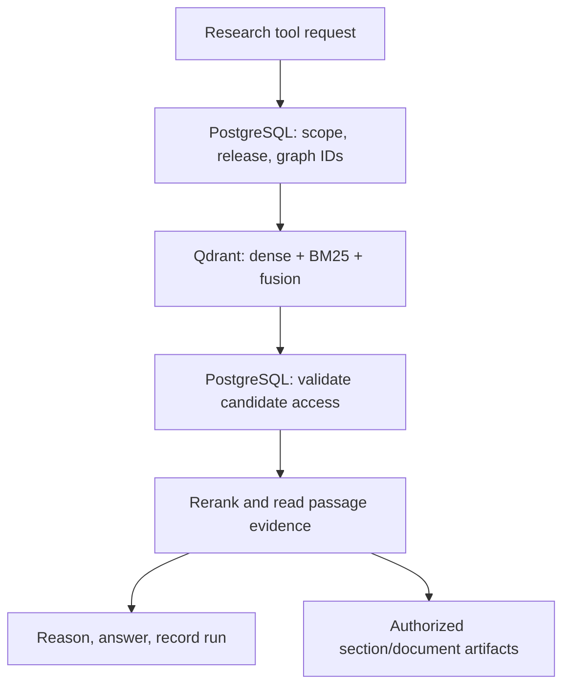

# Qdrant and PostgreSQL — Database Design Changes

**Project:** Scientific Research Platform  
**Date:** 4 October 2026  
**Purpose:** Focused design change note for the plan that keeps both databases.  
**Status:** Researched design proposal; implementation and workload validation remain to be done.

This document covers the revised database responsibilities and the engineering needed to make them work together. It is not a replacement project specification. The existing source-of-truth document is unchanged. The dataset, model selection, agent framework, API scope, and deployment scope are outside this change.

The intended split is: **Qdrant serves research search and passage evidence; PostgreSQL owns the structured catalog, citation relationships, permissions, and durable application state.** Preserved files supply original documents and immutable recovery artifacts.

The recommendations below are project design decisions. Official documentation establishes available capabilities; comparable projects establish useful precedents. Neither establishes performance or correctness for our unbuilt implementation.

## 1. What changes

The immediate previous plan placed live paper metadata and citation-reference arrays in Qdrant and restricted PostgreSQL to an operational ledger. The revised plan gives PostgreSQL the relational catalog and citation graph while retaining a substantial retrieval role for Qdrant.

| Responsibility | Revised use |
| --- | --- |
| Paper identity, identifiers, metadata revisions, authors | PostgreSQL canonical records |
| Citation edges and incoming/outgoing citation queries | PostgreSQL, with edge provenance and coverage |
| Logical corpus membership and access policy | PostgreSQL canonical records |
| Searchable paper title/abstract representations | Qdrant paper search points |
| Searchable passage text and source locations | Qdrant passage payloads |
| Dense and BM25 sparse vectors | Qdrant named vectors |
| Dense/sparse candidate retrieval and fusion | Qdrant Query API |
| Cross-encoder reranking | Existing application/model service, using Qdrant text |
| Jobs, checkpoints, research runs, evidence-use records | PostgreSQL |
| Index manifests, desired index state, publication registry | PostgreSQL plus immutable manifest artifacts |
| PDFs, complete parsed documents, chunk exports, cached vectors | Persistent files/object storage, referenced by checksummed manifests |

Qdrant becomes a **materialized retrieval projection** of the catalog and preserved content. That describes ownership and rebuildability; it does not make Qdrant optional on the live evidence-search path. PostgreSQL does not become a second embedding-search backend, and ordinary search does not fetch every passage's text from SQL.

## 2. Data ownership and deliberate duplication

Every mutable field needs one canonical owner. PostgreSQL owns catalog facts and application state. Immutable artifacts own the exact source and parsed text for a document version. Qdrant serves indexed copies of the fields needed to search and return evidence.

| Data | Canonical owner | Copy retained in Qdrant | Update behavior |
| --- | --- | --- | --- |
| Stable paper ID and external identifiers | PostgreSQL | Paper ID; selected identifiers for display/filtering | Catalog change schedules a search refresh |
| Title, abstract, publication date, authors, topics | PostgreSQL revision | Search text and useful filter/display fields | New projection revision; no independent editing in Qdrant |
| Passage text, parsed structure, offsets | Immutable document/chunk artifacts | Complete passage text and evidence location | New document/chunk version when content changes |
| Citation relationships | PostgreSQL | No authoritative reference arrays | SQL graph tools return candidate IDs |
| Corpus memberships | PostgreSQL | Membership snapshot where useful for search filters | Published with a defined index release |
| User access grants and revocations | PostgreSQL | At most coarse partition/scope hints | Live SQL authorization remains decisive |
| Vectors | Versioned vector artifact/configuration | Dense and sparse vectors | Reuse only when the exact generation configuration matches |
| Research answers and used evidence | PostgreSQL run records and protected artifacts | No separate run-state database in Qdrant | Recorded by the application |

The metadata copies are intentional. Qdrant needs filterable fields and enough provenance to return usable evidence in one search response. It does not need a complete duplicated SQL schema. An author name in a passage payload is a display snapshot, not the editable author record.

PostgreSQL can retain abstracts as catalog metadata. It need not store the entire parsed paper or all passage text in its baseline schema. The immutable chunk export is essential: a database containing vectors and checksums alone cannot recover lost evidence text.

## 3. PostgreSQL's expanded role

### Catalog and relationships

Use a small normalized schema with explicit revisions. These are proposed table groups, not a finished migration:

| Table group | Suggested contents |
| --- | --- |
| `papers`, `paper_identifiers` | Internal UUID, normalized DOI/source IDs, canonical identity, merge/tombstone state |
| `paper_revisions` | Immutable metadata revisions, title, abstract, publication date, metadata source and retrieval time |
| `authors`, `authorships` | Author identities where known; ordered authorship tied to a paper revision |
| `citation_edges`, `unresolved_references` | Source paper revision, resolved target ID or unresolved source identifier, provider, observation time, resolution evidence |
| `corpora`, `corpus_memberships` | Logical corpus definitions and canonical membership |
| `documents`, `document_versions`, `artifacts` | Paper/document association, source checksum, parser version, artifact locations, access/license metadata |
| `chunk_manifests` | Stable chunk IDs, document version, chunk order, text hash and location in the immutable export |
| `index_releases`, `index_release_members` | Release manifest, physical Qdrant names, selected paper/document revisions, configuration hashes, publication state |
| `outbox_events`, `index_jobs` | Durable indexing intent, retries, attempts, failures and reconciliation state |
| `research_runs`, `tool_events`, `run_evidence` | Pinned release, tool inputs/results, exact evidence references, answer and configuration |

Use uniqueness constraints for normalized identifiers and foreign keys for SQL relationships. PostgreSQL documents both facilities. These constraints do **not** verify that a corresponding Qdrant point exists. That requires reconciliation. [P1]

Avoid false identity matches. A title match is insufficient to merge papers or resolve a citation. Preserve unresolved references instead of manufacturing graph edges. Citation targets outside the ingested full-text corpus may exist as metadata stubs, with explicit evidence availability.

### Citation tools

Incoming citations become a query on `target_paper_id`; outgoing citations become a query on `source_paper_id` and the appropriate source revision. Index both directions. Multi-hop expansion may use bounded SQL queries or recursive CTEs; PostgreSQL supports recursive queries, but our service must still enforce depth, fan-out, cycle and time limits. [P2]

Return both graph results and coverage: provider, observation time, unresolved counts, metadata-only targets, and any traversal limit reached. “No citations found in the ingested graph” does not mean that the paper has never been cited.

For a run pinned to an index release, constrain traversed source revisions to the release manifest. An edge may identify an external target, but passage search can only use targets with indexed content in that release. Store the actual graph candidate set and edge provenance in the tool result. This supports inspection even if later enrichment changes the catalog.

### Transactions and workflow state

Keep related catalog updates and their indexing intent in one SQL transaction. Keep research-run lifecycle and job-claiming state here as well. Do not hold a transaction open while parsing a PDF, calling an embedding model, or uploading thousands of points.

Workers may claim queue rows with `FOR UPDATE SKIP LOCKED` in a short transaction. PostgreSQL explicitly describes this as useful for queue-like consumers and unsuitable for general consistent reads. It does not establish event ordering or protect external writes after a lease expires. [P3]

## 4. Qdrant's substantive role

Use two logical search collections, implemented as versioned physical collections for publication:

| Logical collection | Unit | Search representation | Returned payload |
| --- | --- | --- | --- |
| Paper search | One selected paper revision | Title/abstract dense vector and BM25 sparse vector | Paper identity, revision, metadata snapshot, content availability |
| Passage search | One immutable evidence chunk | Passage dense vector and BM25 sparse vector | Full chunk text, paper/document/chunk IDs, source location and hashes |

Dense retrieval, sparse retrieval and Reciprocal Rank Fusion run inside Qdrant. Its Query API supports prefetch branches and fusion. Candidate depth and the final result count are distinct settings. Cross-encoder reranking remains outside Qdrant in this design. [Q1]

### Retrieval representations

Proposed baseline:

- Named dense vector `dense`, using the project's evaluated embedding model and its actual output dimension.
- Named sparse vector `bm25`, using a pinned BM25 implementation with matching document/query preprocessing and an IDF modifier.
- Self-hosted native `Qdrant/bm25` encoding is a supported implementation option; current official guidance documents support from Qdrant 1.15.3. Pin and integration-test an exact server/client pair before adoption. This is a capability floor, not a recommendation to deploy that old version. [Q2]

Do not mix encoders, tokenization parameters, or dense models inside a representation under the same name. A BM25 representation is not interchangeable with SPLADE. A full-text payload match filter is also not a ranked BM25 retriever; Qdrant documents full-text indexes as filtering facilities. [Q3]

For document and query encoding, record the model/configuration digest, tokenizer and normalization, dense dimension/distance, and sparse IDF settings. The exact dense model remains outside this database change.

### Payload design

The following is an illustrative passage payload. Identifiers, hash labels, artifact paths and evidence text are examples, not real research evidence:

```json
{
  "paper_id": "11111111-1111-5111-8111-111111111111",
  "paper_revision": 3,
  "document_version_id": "22222222-2222-5222-8222-222222222222",
  "chunk_id": "33333333-3333-5333-8333-333333333333",
  "release_id": "release-001",
  "text": "Illustrative evidence passage text.",
  "paper_title": "Illustrative paper title",
  "publication_year": 2024,
  "author_ids": ["author-example"],
  "topic_ids": ["topic-example"],
  "corpus_ids": ["corpus-example"],
  "section_id": "section-4",
  "section_title": "Results",
  "chunk_order": 12,
  "page_start": 7,
  "page_end": 7,
  "text_sha256": "example-text-sha256",
  "chunk_export_key": "artifacts/document-v3/chunks.jsonl",
  "chunk_export_sha256": "example-export-sha256",
  "pipeline_config_hash": "example-pipeline-hash"
}
```

Page numbers and offsets are nullable when the parser cannot establish them. Character offsets must name their coordinate system, such as the normalized parsed-text artifact. Do not label HTML-derived offsets as PDF page coordinates. Artifact keys are resolved through an authorized service, rather than exposed as permanent public URLs.

A paper-search point additionally contains its searchable title/abstract and selected identifiers. Keep the full authorship and citation relations in SQL. Passage payloads contain only the author IDs and display fields required by actual queries.

Create payload indexes for the fields the workload filters on, initially `paper_id`, `corpus_ids`, publication year, author IDs and topic IDs. Create these before bulk ingestion so the filter-aware HNSW graph can benefit from them, as the official indexing guide recommends. Do not index every text field by default. [Q3]

Use deterministic UUID point IDs. Qdrant accepts UUID IDs and overwrites an existing point on repeated upsert to the same ID. [Q4] Our proposed identities are:

- Paper point: UUID derived from canonical paper ID plus metadata revision.
- Passage point: immutable chunk UUID derived from document version, chunker configuration, ordinal and text hash.
- Release identity: stored separately; physical collection names provide release isolation.

A changed passage gets a new chunk identity. The same chunk may retain its ID across separate physical releases, allowing evidence references to remain stable. A replay of an identical upsert is safe; a replay of an older, different payload is not automatically safe.

### Why publication uses physical collections

For the first implementation, use one shard per physical collection and keep each published release immutable. For example, `paper_search_r001_a1` and `passage_search_r001_a1` form a validated pair. A later release gets another pair.

This prevents staged and retired document revisions from sharing the live sparse-statistics population. In current Qdrant documentation, default IDF statistics are computed across the queried shard. The separately documented IDF corpus filter, available from 1.19, is independent of the retrieval filter. We should not assume that a year or corpus retrieval filter automatically recalculates BM25 statistics over its results. [Q5]

The baseline uses release-wide IDF in its single shard, including when searching a subset. It does not promise subset-specific BM25. Per-corpus IDF and multiple shards are later options requiring compatibility and relevance tests.

Physical release isolation has a cost: a staged release needs its own points and indexes, including unchanged records. Reuse cached compatible vectors to avoid repeated model inference, but budget for index construction and storage. Publish in batches or on explicit request, rather than rebuilding after every individual metadata update. Measure this approach against the actual corpus before committing to high-frequency ingestion.

## 5. Synchronization and safe publication

### Durable indexing intent

Use a transactional outbox: the same SQL transaction that accepts a catalog/document change also inserts an event requesting indexing. A polling worker processes committed events and retries failures. Duplicate delivery is expected, so processing must be idempotent. AWS's official outbox guidance explains the dual-write failure and this pattern; using it here does not require AWS services or a message broker. [S1]

The outbox guarantees durable intent associated with a committed SQL change. It does not make the later Qdrant operation part of that SQL transaction. Ordering, publication checks and reconciliation remain application responsibilities.

### Proposed publication protocol

1. **Preserve content first.** Write the source, parsed document and immutable chunk export to durable storage; verify their checksums. A failed subsequent SQL transaction may leave orphan files, which can be cleaned up later. There is no shared file/SQL transaction.
2. **Commit accepted revisions and intent.** In one SQL transaction, record catalog/document revisions, artifact references and the outbox event. Expose ingestion state as accepted or pending, not searchable.
3. **Freeze the build input.** Create a release manifest selecting exact paper revisions, document versions, chunk IDs, metadata/filter values and model/configuration digests. Capture these in a consistent SQL snapshot and export the immutable manifest. Later catalog changes go into another release.
4. **Allocate a build attempt.** Register a unique attempt token and fresh physical paper/passage collection names. Use one active build per corpus and one writer per collection in the baseline. The worker populates both from that manifest, reusing cached vectors only when compatible. New changes wait for the next build.
5. **Verify before publication.** Stop issuing writes and drain outstanding operations using the deployed API's completion settings. Check collection health, manifest membership, required vectors, exact counts, version/hash agreement, and paper/passage associations. Counts alone are insufficient; compare the exported point IDs and required payload hashes with the manifest. Also run representative filtered searches. Verification must finish after the last write.
6. **Publish with a SQL pointer.** In a short transaction, lock the corpus registry row and verify its current build token, validated state and expected predecessor release. Then atomically move the published-release pointer and record its two physical collection names together. A superseded build cannot publish; rollback is a separate explicit operation. Events covered by the manifest may be marked satisfied; later changes remain pending. Do not infer this boundary from the maximum event ID alone, because sequence allocation is not commit order.
7. **Pin research runs.** At run creation, resolve the published-release pointer once and store the physical names and manifest/configuration digests. Every search in that run uses that pair. Do not resolve a moving `current` alias independently at each tool call.
8. **Retain and retire explicitly.** Keep old releases while active runs require them. Retain immutable evidence snapshots and rebuild artifacts according to a documented policy before deleting retired collections. A deletion or access revocation overrides normal retention where applicable.

The registry is the application publication boundary, not a cross-database transaction. A Qdrant failure after publication still causes an availability failure. The service reports that failure; it does not silently use an unrelated release.

Qdrant supports atomic alias changes within Qdrant. That does not atomically update PostgreSQL. Optional aliases may aid administration, but the application uses physical names from the SQL release registry to avoid a second competing publication mechanism. [Q6]

### Retries, stale workers and reconciliation

Retries within the same live build attempt upsert the same manifest-derived point IDs and values. An older event does not overwrite a newer live projection; it either schedules a release from a selected manifest or is recognized as already covered by a published revision.

If a worker lease expires and ownership transfers, abandon its physical build attempt and allocate new collection names. The replacement does not share writable collections with a potentially still-running worker. SQL token checks prevent the abandoned attempt from publishing. This avoids pretending that a `revision` payload field is a Qdrant compare-and-swap lock. Abandoned collections are garbage-collected only after their writers have stopped.

Published collections are application-immutable: the writer only targets registered staging attempts. Qdrant consistency/ordering options address operations and replicas within Qdrant; they do not enforce this release protocol or a SQL transaction. [Q7]

A reconciliation job compares desired manifests, published registry entries and actual collection contents. It detects missing collections, incomplete builds, unexpected IDs, mismatched hashes, stuck jobs and abandoned attempts. Outbox lag, ingestion acceptance and search publication are distinct metrics.

## 6. How reads use both databases



This diagram shows data responsibilities. It does not imply that every tool executes every step.

### Normal evidence search

1. The service resolves the authenticated scope and the run's pinned release. It validates requested filters against the release's metadata snapshot semantics.
2. It encodes the query with the release's dense/BM25 configuration and applies the same eligibility filters to both candidate branches before fusion.
3. Qdrant returns candidate IDs and payloads containing complete passage text and evidence locations. Routine results omit vectors unless diagnostics need them.
4. The service batch-checks candidate paper/document IDs against current SQL access policy, tombstones and the release manifest. It does not fetch the text again from PostgreSQL. If validation removes too many candidates, it can retry with a larger retrieval budget, up to a documented cap; otherwise it returns fewer authorized results with a limitation flag.
5. Authorized candidates enter the cross-encoder and evidence-selection stage. The LLM receives selected passages and can request authorized surrounding sections or complete documents from preserved artifacts.
6. PostgreSQL records the run, actual tool outputs and evidence references. Preserve the exact used text/location snapshot and hashes in protected run evidence so later catalog edits cannot silently alter the answer's sources.

Qdrant does the expensive corpus candidate retrieval and supplies evidence content. PostgreSQL supplies exact relationships and state validation. Which component consumes more CPU or latency is a measurement, not something this architecture can establish.

### Citation-led evidence search

For “find papers citing paper X and explain their findings,” SQL resolves X and the observed incoming edges. Intersect the targets with the release's indexed-paper membership and current permitted scope. Pass this bounded paper-ID set into Qdrant, which retrieves relevant passages from those papers. Return coverage and excluded metadata-only targets with the tool result.

An empty eligible set returns no eligible evidence. Never drop an empty paper filter and search the entire corpus instead. Exact DOI/source-ID lookup uses PostgreSQL; fuzzy discovery by title, abstract or research question uses Qdrant.

Large graph result sets need an explicit strategy. The baseline has configurable candidate-ID, traversal and request-size budgets; exceeding them returns a partial-result flag or asks the agent to narrow the query. Do not silently truncate and claim exhaustive coverage. Independently fused results from different ID batches cannot simply be concatenated into a globally valid RRF ranking. A future batching implementation needs a defined branch-merge/fusion policy and its own retrieval evaluation.

## 7. Consistency, permissions and freshness

The contract is **transactional catalog updates, asynchronous search publication, immutable evidence identities, and live authorization checks**.

| Situation | Required behavior |
| --- | --- |
| New paper accepted in SQL | Pending until a validated release includes it |
| Metadata corrected after publication | Exact catalog lookup can show the latest value; search filters/display snapshots remain tied to the run's release |
| PDF, parser or chunker changes | New document/chunk version; publish a new release |
| Membership changes | New search-scope snapshot for a subsequent release; current access policy can restrict older runs |
| Citation enrichment changes | Graph tool records its observed edges and provenance; no promise of a long-lived SQL snapshot spanning every run step |
| Access revoked or paper tombstoned | Reject on live SQL validation, including direct evidence reads and cached/run evidence access |
| PostgreSQL authorization unavailable | Fail closed for protected research reads |
| Qdrant unavailable | Catalog operations may remain available; evidence search reports unavailable |

Metadata filters operate on the pinned index snapshot. If a year correction should take effect in search immediately, that is a different freshness requirement: it needs an expedited publication or a separately designed SQL-first filter path. Post-filtering can remove stale false positives, but cannot recover relevant candidates excluded by a stale Qdrant filter.

Do not use projected payload permissions as the sole security decision. Validate before sending retrieved text to the reranker, LLM, user, external tracing or shared caches. For strict tenant isolation, also establish the authorized Qdrant partition/filter before retrieval. Credentials for Qdrant stay in trusted backend services; callers do not receive unrestricted database access.

This is authorization at defined checks, not an atomic guarantee against a concurrent revocation midway through model processing. Revalidate access when delivering results and resolving saved evidence. If stronger revocation semantics become a product requirement, specify coordination and in-flight cancellation separately.

Store the index release, catalog/graph observation times, exact evidence and configuration versions. These enable audit and input replay. They do not guarantee bit-identical ANN rankings or LLM answers across rebuilt indexes, hardware or nondeterministic inference.

## 8. Recovery, retention and operating cost

Back up all three parts: PostgreSQL, Qdrant, and immutable source/index artifacts. PostgreSQL documents logical dumps, filesystem backups and continuous archiving as different recovery approaches. Select one appropriate to the deployment and test restoration. [P4]

Qdrant collection snapshots contain collection data/configuration but exclude aliases; distributed deployments require node-aware snapshot handling. The initial single-node deployment is simpler, but its snapshot is not a backup of SQL or original PDFs. [Q8]

Each backup set should include a manifest mapping SQL release records to physical collections, source/chunk/vector artifacts and checksums. Independent backups are not automatically a consistent joint checkpoint. After restore, validate the referenced release before serving it; rebuild missing projections from retained manifests/artifacts when necessary.

Keep the catalog snapshot or metadata exports needed to reconstruct each retained release. Current catalog values alone cannot recreate an old metadata projection. Cache compatible vectors if fast, faithful index recovery matters; regenerating embeddings can be expensive and may differ with software/hardware changes.

Deleting a Qdrant collection is safe only after active references and evidence-retention requirements are addressed. Backups, artifacts and run evidence need a deletion/retention policy too. A tombstone blocks access promptly; physical purging is a separate tracked operation.

Initial operation needs PostgreSQL, Qdrant, the existing application/worker, and durable artifact storage. A SQL outbox does not by itself require Kafka, Redis or another broker. PostgreSQL embedding indexes, Elasticsearch and a graph database are not introduced by this change.

Measure: accepted-to-searchable lag; outbox age; build duration; failed/retried attempts; reconciliation mismatches; search/SQL/reranker latency; recall under restrictive filters; and disk/RAM with one live plus one staged release. Raw dense-vector bytes are only part of Qdrant's footprint: sparse vectors, payloads, indexes, storage structures and release duplication also matter.

## 9. Benefits and costs of this split

| Benefit | Why it helps | Cost or limitation |
| --- | --- | --- |
| Clear catalog integrity | SQL constraints and relationships support identity, authorship and citation queries | Additional schema and SQL migrations |
| Substantial Qdrant use | Dense/sparse retrieval, fusion, filters and evidence text all live in the serving path | Two databases must be operated and monitored |
| Evidence without per-chunk SQL hydration | Search results contain usable text/provenance | Metadata and text copies increase storage |
| Better citation-led tools | Relational edges support incoming/outgoing queries and bounded expansion | Provider coverage and identity resolution still limit graph accuracy |
| Controlled publication | Runs pin one verified search release | Batch freshness, staging storage and rebuild time |
| Recoverable ingestion | Durable intent and manifest-based replay make failures diagnosable | Reconciliation and restore tests are real engineering work |
| Separate policy and search state | Revocations do not wait for embedding/index refresh | Live validation adds a SQL dependency and possible candidate refill work |

The recommendation is to keep both because the project needs both evidence retrieval and relational research operations. It is not a claim that two databases always beat one, or that hybrid retrieval always improves quality. Those claims need workload evidence.

## 10. What comparable projects actually establish

| Primary project evidence | Observed approach | Lesson for this change | What it does not validate |
| --- | --- | --- | --- |
| Dify relational dataset models, deployment configuration and Qdrant adapter [R1–R3] | Relational datasets/documents/segments; deployable PostgreSQL; configurable Qdrant backend whose adapter stores and returns passage content/metadata in payloads | A relational application catalog and a vector serving layer can coexist; payload text is a practical serving choice | Our citation schema, immutable releases, outbox protocol or performance. Dify also retains segment content in SQL, unlike our baseline chunk-artifact ownership |
| GAIR-NLP OpenResearcher paper and repository [R4–R5] | Scientific assistant using Qdrant dense/SPLADE retrieval, separate Elasticsearch BM25 and reranking | Qdrant is a concrete scientific-retrieval precedent; retrieval and reranking are substantive components | A PostgreSQL/Qdrant catalog split or BM25 inside Qdrant. Its SPLADE representation is different from our proposed BM25 representation |
| FutureHouse PaperQA repository [R6] | Scientific document QA with keyword discovery, chunk retrieval and contextual evidence processing; NumPy default and an optional Qdrant vector store | Search should select evidence before answer generation; storage scale should justify the backend | Our exact dual-database synchronization or a requirement that every scientific QA system needs Qdrant |

These projects support the design direction. The exact consistency and publication protocol here is our proposal, not an implementation copied from those projects. Repository `main` branches are moving references; record inspected commit SHAs when implementation work begins.

## 11. Implementation order and acceptance checks

1. Add the PostgreSQL catalog, identifier, citation, document-version and manifest schema. Migrate authoritative metadata from the existing Qdrant design using preserved ingest artifacts where possible; reconcile identity and retain provenance.
2. Implement deterministic chunk/point identity, immutable artifact exports and the transactional outbox.
3. Build staging paper/passage collections with dense/BM25 representations and the required payload indexes. Choose and pin the server/client/configuration after a small compatibility spike.
4. Implement manifest verification, SQL publication, run pinning and candidate authorization. Add SQL citation tools that pass eligible IDs to Qdrant.
5. Run retrieval comparisons and failure/recovery checks before enabling the new serving path. Retire prior collections only after evidence references and rollback needs are covered.

Required checks for implementation:

- SQL rollback creates neither an accepted revision nor a committed indexing event.
- Crash after SQL commit leaves work recoverable; crash after an upsert permits safe replay.
- Duplicate events do not duplicate paper/chunk points; old events do not revert newer published state.
- A partial paper/passages build never becomes published. A stale attempt cannot publish or write into the replacement's collections.
- Publication does not change an already-running run's physical collection pair.
- Manifest/point discrepancies prevent publication, including correct counts with incorrect IDs or hashes.
- Citation tools report unresolved/external targets and enforce budgets; empty eligibility never becomes unrestricted search.
- Revoked content is blocked from new model inputs, direct evidence reads, cached results and saved-run access at the defined authorization checks.
- Search returns passage text from Qdrant while SQL lookups validate state without rehydrating every chunk.
- Restore succeeds with preserved SQL/artifacts and a restored or rebuilt validated Qdrant release.
- Dense-only, BM25-only and fused retrieval are compared on the same pinned corpus and held-out questions. Measure recall/ranking, restrictive-filter behavior, reranking gain, latency and resource use.

No application, database cluster, migration or retrieval benchmark was executed to produce this note. The research validates capabilities and precedents; these acceptance checks are still required to validate our implementation.

## 12. Primary sources

Sources checked on 4 October 2026. References support nearby capability claims and project observations; project-specific schemas, ownership and publication rules are recommendations.

- **[Q1]** Qdrant, [Hybrid Queries](https://qdrant.tech/documentation/search/hybrid-queries/).
- **[Q2]** Qdrant, [Hybrid Search in Qdrant](https://qdrant.tech/documentation/search-tuning/hybrid-search/), including the native BM25 capability/version floor.
- **[Q3]** Qdrant, [Indexing](https://qdrant.tech/documentation/manage-data/indexing/), including payload-index timing and full-text filtering.
- **[Q4]** Qdrant, [Points](https://qdrant.tech/documentation/manage-data/points/), including IDs and repeated upsert behavior.
- **[Q5]** Qdrant, [Multitenancy: per-tenant IDF statistics](https://qdrant.tech/documentation/manage-data/multitenancy/), including default shard statistics and the separate IDF corpus filter.
- **[Q6]** Qdrant, [Collections](https://qdrant.tech/documentation/manage-data/collections/), including atomic alias actions.
- **[Q7]** Qdrant, [Consistency Guarantees](https://qdrant.tech/documentation/scaling/consistency-guarantees/).
- **[Q8]** Qdrant, [Snapshots](https://qdrant.tech/documentation/snapshots/).
- **[P1]** PostgreSQL, [Constraints](https://www.postgresql.org/docs/current/ddl-constraints.html).
- **[P2]** PostgreSQL, [WITH Queries](https://www.postgresql.org/docs/current/queries-with.html).
- **[P3]** PostgreSQL, [SELECT: locking clauses](https://www.postgresql.org/docs/current/sql-select.html).
- **[P4]** PostgreSQL, [Backup and Restore](https://www.postgresql.org/docs/current/backup.html).
- **[S1]** AWS Prescriptive Guidance, [Transactional outbox pattern](https://docs.aws.amazon.com/prescriptive-guidance/latest/cloud-design-patterns/transactional-outbox.html).
- **[R1]** Dify, [relational dataset/document models](https://github.com/langgenius/dify/blob/main/api/models/dataset.py).
- **[R2]** Dify, [deployment configuration](https://github.com/langgenius/dify/blob/main/docker/docker-compose.yaml).
- **[R3]** Dify, [Qdrant vector backend implementation](https://github.com/langgenius/dify/blob/main/api/providers/vdb/vdb-qdrant/src/dify_vdb_qdrant/qdrant_vector.py).
- **[R4]** GAIR-NLP, [OpenResearcher repository](https://github.com/GAIR-NLP/OpenResearcher).
- **[R5]** OpenResearcher authors, [EMNLP 2024 demonstration paper](https://aclanthology.org/2024.emnlp-demo.22.pdf), especially the retrieval implementation description.
- **[R6]** FutureHouse, [PaperQA repository](https://github.com/Future-House/paper-qa), especially evidence retrieval and vector-store documentation.
